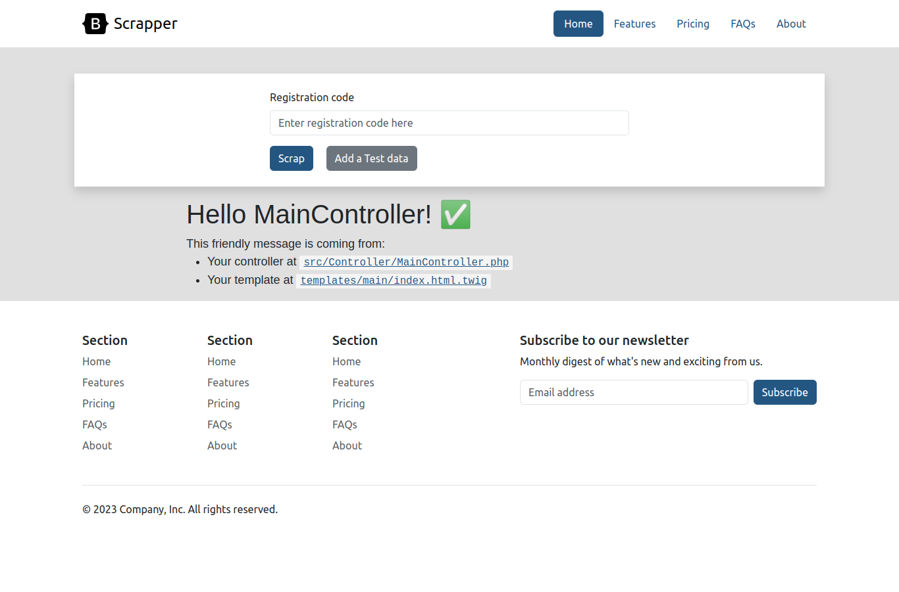

# Scrapper
Web Scrapper using Symfony 6

Setting up Docker
---------------
Make sure you have Docker Desktop installed on your local machine. If you don't have it installed, you can download it from the official Docker website: 

https://www.docker.com/products/docker-desktop.

Running the Application
---------------
To run the application, follow these steps:

1. Clone the repository to your local machine.
```
git clone https://github.com/skate18/scrapper
```
2. Navigate to the project directory.
```
cd your_project_folder/scrapper
```
3. Execute the following command:
```
docker-compose up
```

This command will start the Docker containers and set up the necessary dependencies.

Wait for the process to finish. Once it's completed, you can access the application by visiting the following URL in your web browser:

http://localhost:8081


Screenshots
---------------
During the development process, I have included several screenshots to provide visual references.





